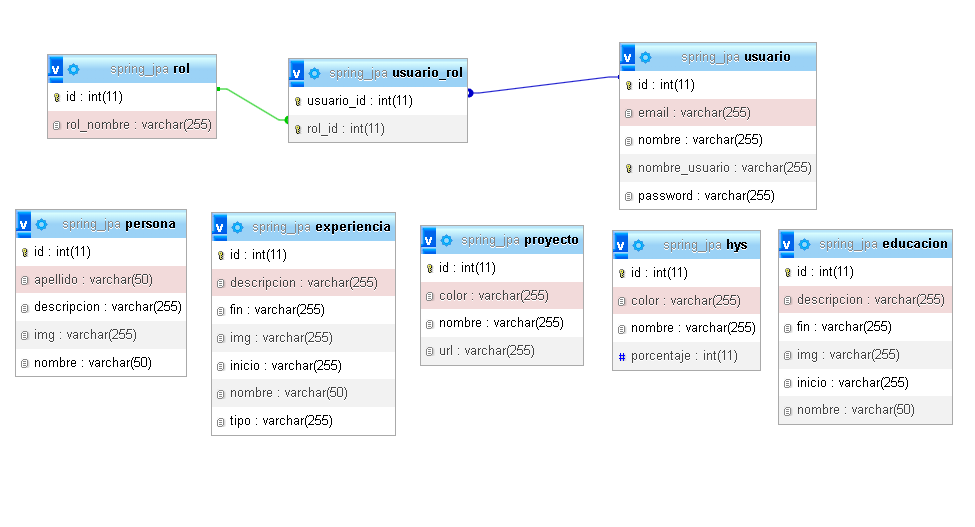

#Bienvenido al repositorio BackEnd de mi portafolio personal.
####Descripción:
Mi portafolio personal nace debido a presentar un proyecto integrador del curso de Argentina Programa, fase #YoProgramo, si quieres ver el curso, puedes dar click aquí

####Objetivos del proyecto:
Mis objetivos del proyecto son poder mostrar mis habilidades, experiencia, estudios y proyectos que fui desarrollando a lo largo de mi vida como programador.

####Uso:
La aplicación web funciona con un sistema de logeo para poder crear, editar, eliminar, modificar los datos, si desea probar las funcionalidades puede contactarme. Correo

####Tecnologías utilizadas:
#####Lenguajes:
#####Java: Para desarrollar la aplicación de servidor. SQL: para trabajar con conjuntos de datos y las relaciones entre ellos.

#####Frameworks:
Spring Boot: Para crear aplicaciones web de manera rápida y sencilla.

#####Dependencias:
Spring Web: Para crear aplicaciones web basadas en Spring MVC, el controlador maneja las solicitudes y las respuestas, el modelo maneja la lógica de negocios y la vista maneja la presentación de datos al usuario final.

#####JPA: Para trabajar con bases de datos relacionales de manera más fácil y eficiente, creación automática de tablas en la base de datos, mapeo objeto-relacional, consultas JPQL.

#####mysql driver: Para la conectividad y manipulación de datos en una aplicación Java que utiliza MySQL como su sistema de gestión de bases de datos.

#####Validation: Para validar los datos de entrada en la aplicación, se pueden agregar anotaciones de validación a las clases de modelo de datos y Spring Boot automáticamente valida los datos de entrada y devuelve errores de validación en caso de que los datos no cumplan con los criterios de validación especificados.

#####spring boot devtools: Para Reinicio automático de la aplicación, Recarga en vivo (LiveReload).

#####Lombok: Para simplifica el desarrollo de software al generar automáticamente código de boilerplate común, como getters, setters, constructores, equals, hashCode y toString, a través de anotaciones.

####Seguridad:
JSON Web Token: Para creación de tokens de acceso que permiten la propagación de identidad.

Encriptacion de contraseña: Para ocultar datos sensibles.

####DER:

####Contribución
Este proyecto fue desarrollado de manera individual y no está abierto a contribuciones externas en este momento. Sin embargo, si encuentras algún error o bug, por favor contáctame para que pueda solucionarlo.

####Licencia:
La Licencia que utilizo en mi proyecto es gnu gpl v 3 los términos que se aplican son los siguientes.

Derechos de los usuarios: La licencia garantiza a los usuarios la libertad de ejecutar, copiar, distribuir, modificar y mejorar el software.

Obligaciones de los usuarios: Los usuarios tienen la obligación de proporcionar a otros usuarios las mismas libertades para el software modificado que se les dio originalmente.

Copyleft: La licencia incluye una cláusula de copyleft que requiere que cualquier trabajo derivado del software original se distribuya bajo los mismos términos de la GNU GPL v3.

Patentes: La licencia establece que cualquier patente que cubra el software o sus aplicaciones debe ser concedida bajo los mismos términos que la GNU GPL v3.

Combinación con otros programas: Si un programa se distribuye junto con otros programas que no están cubiertos por la GNU GPL v3, los términos de la GNU GPL v3 se aplican solo al programa cubierto por la licencia.

Estos son solo algunos de los términos que se aplican en la GNU GPL v3, pero la licencia es bastante detallada y cubre muchos otros aspectos importantes del software libre y su distribución. SI quiere profundizar mas, puede dar click Aquí
